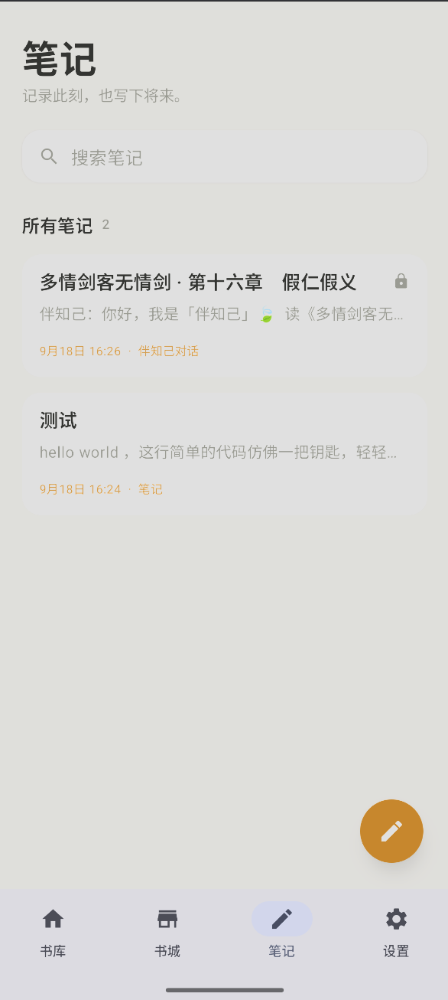
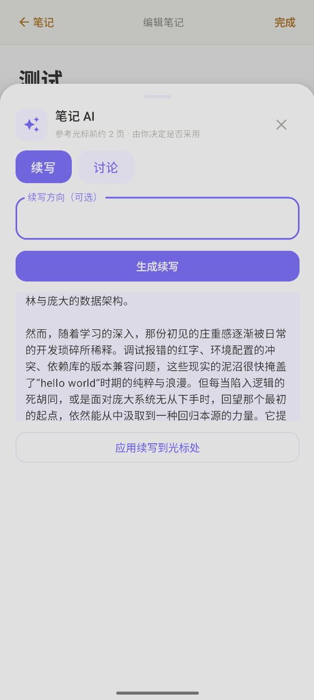

# 智读 · Zhidu

### 让阅读不止停留在读完

一款面向电子书阅读的 AI 辅助应用。
在安静、专注的阅读体验中，留下思考，也留下与文字相遇的回声。

 

<a href="../../releases/latest">下载公测版</a> ·
<a href="../../issues">反馈问题</a>

  

 

## 关于智读

智读希望把电子书阅读做成一段更有温度的独处时间。你可以导入自己的电子书，在舒适的排版和阅读模式中继续阅读；也可以在读到某个段落时，和“伴知己”聊聊感受，或请“解先生”帮助理解一段文字。

书籍、笔记和阅读进度默认保存在本机。AI 仅在用户主动配置服务并发起请求时工作。

## 公测版 0.3.0918

2026 年 9 月 18 日更新。

本次更新重点完善了 AI 陪伴与笔记体验：

- 伴知己新增标准、角色扮演、吐槽、思想家、感性者五种陪读模式
- 全新备忘录风格笔记：搜索、置顶、左滑操作、全屏编辑和字号调整
- 笔记 AI 支持续写与多轮讨论，续写结果确认后才写入正文
- 自定义笔记支持 TXT、EPUB 导出，也可以直接加入本地书库
- 伴知己聊天记录按发言人分段保存，可以打开和删除，但不可编辑
- 讨论模式默认半屏显示，可切换全屏，并保留多轮对话
- 书城提供公版书资源导航，当前收录文硕阁
- 保留上下滚动、左右翻页、章节气泡、全屏阅读和阅读位置恢复

### 界面预览

  
  

## 使用说明

### 开始阅读

1. 在书库点击导入按钮，从手机中选择 TXT、EPUB、PDF、MOBI 或 AZW3 文件。
2. 点击书籍封面进入阅读。应用会自动保存阅读位置，下次打开可继续阅读。
3. 点击阅读页面可显示或隐藏上下菜单；在设置中可切换上下滚动或左右翻页。
4. 阅读到章节末尾后，可继续滑动进入下一章，也可使用章节切换按钮。

### 使用 AI

1. 进入“设置 → API 设置”，填写兼容 OpenAI 格式的服务地址、模型和 API Key。
2. 使用“测试连接”确认配置可用。
3. 阅读时选中文字或打开 AI 功能，选择伴知己交流感受，或请解先生解释文本。
4. API 请求会发送至你选择的 AI 服务商，请勿在对话中发送敏感信息。

### 使用笔记

- 在笔记栏目点击新建笔记，可创建、编辑、搜索、置顶或删除自定义笔记。
- 长按笔记并左滑，可显示置顶或取消置顶、删除按钮；右滑可收回操作按钮。
- 笔记 AI 通过悬浮按钮打开，可选择续写或讨论；讨论不会修改正文。
- 伴知己聊天记录可以导出到笔记，记录可打开、删除和复制，但不可编辑或导出。
- 自定义笔记可以导出为 TXT 或 EPUB，也可以加入本地书库；不支持从外部文件导入笔记。

### 使用书城

书城仅提供经过审核的公版书资源导航。首次进入需阅读并同意声明；内置浏览器只允许访问白名单域名。当前收录文硕阁，下载的支持格式会导入应用私有书库，不写入公共 Download 文件夹。

## 下载与安装

打开 [Releases](../../releases) 页面，下载最新公测版 APK。在 Android 手机上允许本次安装来源后完成安装。

本仓库只提供 Android 安装包、使用说明和界面截图，不包含源代码。公测版可能存在兼容性问题，建议保留原始电子书文件和重要笔记备份。

## AI 服务与隐私

智读不内置 AI 服务，也不代替用户提供 API Key。你可以配置兼容 OpenAI 格式的 DeepSeek、通义千问、OpenAI 或本地 Ollama。除用户主动发起的 AI 请求外，应用不会主动上传本地书籍和笔记内容。第三方服务的数据处理以其隐私政策为准。

## 测试反馈

如果你遇到崩溃、排版异常、章节识别错误或 AI 回复问题，欢迎提交 [Issue](../../issues)。建议附上手机型号、Android 版本、电子书格式和复现步骤。请不要公开 API Key、个人信息或受版权保护的完整书籍内容。

 

*读一本书，也听见自己。*

# 智读 · Zhidu

### 让阅读不止停留在读完

一款面向电子书阅读的 AI 辅助应用。
在安静、专注的阅读体验中，留下思考，也留下与文字相遇的回声。

 

<a href="../../releases/latest">下载公测版</a> · <a href="../../issues">反馈问题</a>

  

## 关于智读

智读希望把电子书阅读做成一段更有温度的独处时间。你可以导入自己的电子书，在舒适的排版和阅读模式中继续阅读；也可以在读到某个段落时，和“伴知己”聊聊感受，或请“解先生”帮助理解一段文字。

书籍、笔记和阅读进度默认保存在本机。AI 仅在用户主动配置服务并发起请求时工作。

## 公测版 0.2.0913

- 支持 TXT、EPUB、PDF、MOBI、AZW3 导入
- 支持上下滚动与左右翻页两种阅读方式
- 支持连续跨章节阅读和阅读位置恢复
- 支持章节末尾与停留提醒气泡
- 支持伴知己与解先生 AI 对话
- 支持自定义笔记和对话导出笔记
- 支持书城公版资源导航（目前仅收录文硕阁）

## 使用说明

### 开始阅读

1. 在书库点击导入按钮，从手机中选择 TXT、EPUB、PDF、MOBI 或 AZW3 文件。
2. 点击书籍封面进入阅读。应用会自动保存阅读位置，下次打开可继续阅读。
3. 点击阅读页面可显示或隐藏上下菜单；在设置中可切换上下滚动或左右翻页。
4. 阅读到章节末尾后，可继续滑动进入下一章，也可使用章节切换按钮。

### 使用 AI

1. 进入 设置 → API 设置，填写兼容 OpenAI 格式的服务地址、模型和 API Key。
2. 使用“测试连接”确认配置可用。
3. 阅读时选中文字或打开 AI 功能，选择伴知己交流感受，或请解先生解释文本。
4. API 请求会发送至你选择的 AI 服务商，请勿在对话中发送敏感信息。

### 使用笔记

- 在笔记栏目点击新建笔记，可创建、编辑、置顶或删除自定义笔记。
- 长按笔记并左滑，可显示置顶或取消置顶、删除按钮；右滑可收回操作按钮。
- 伴知己的聊天记录可以导出到笔记，导出的记录可打开和删除，但不可编辑。
- 自定义笔记可以导出为 TXT 文件；笔记不支持从外部文件导入。

### 使用书城

书城仅提供经过审核的公版书资源导航。首次进入需阅读并同意声明；内置浏览器只允许访问白名单域名。当前收录文硕阁，下载的支持格式会导入应用私有书库，不写入公共 Download 文件夹。

## 下载与安装

打开 [Releases](../../releases) 页面，下载最新公测版 APK。在 Android 手机上允许本次安装来源后完成安装。本仓库只提供 Android 安装包，不包含源代码。

## AI 与隐私

智读不内置 AI 服务，也不代替用户提供 API Key。可配置兼容 OpenAI 格式的 DeepSeek、通义千问、OpenAI 或本地 Ollama。除用户主动发起的 AI 请求外，应用不会主动上传本地书籍和笔记内容。第三方服务的数据处理以其隐私政策为准。

## 测试反馈

欢迎提交 [Issue](../../issues)，建议附上手机型号、Android 版本、电子书格式和复现步骤。请不要公开 API Key、个人信息或受版权保护的完整书籍内容。

 <i>读一本书，也听见自己。</i>

